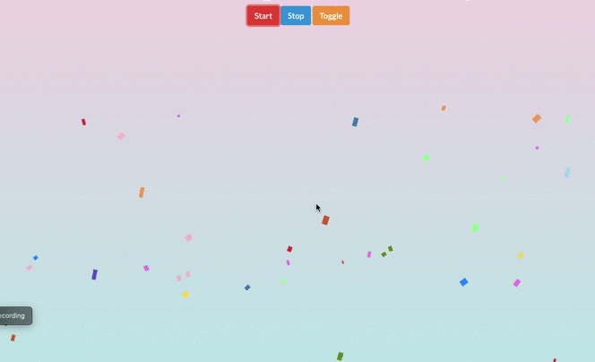

# Instructions

Your aim is to create a Confetti rain project in React as shown in following gif

## Requirements

- You should have three buttons to control confetti rain
  - `Start` button click stop start the confetti rain
  - `Stop` button click should stop the confetti rain
  - `Toggle` button click should change confetti rain direction, bottom to top.
- Deploy your project on cloud platform of your choice(ex. Netlify, Heroku, AWS, etc)
- You can use simple square boxes of small size(not more than 24px X 24px) as confetti.

## Workflow

- **The main aim of this task is to able to pair program and collaborate with a buddy.**
- Each person will be assigned a buddy.
- Choose either your's or your buddy's repo to work on this exercise.
  - Don't worry if it's not your own repo. We will give write permissions to both you and your buddy for the question. So your commits will be preserved.
- All work should be submitted via pull requests.
- Make sure that your buddy reviews your PR and vice-versa you review your buddy's PR.
- You can use VS Code Live Share or Zoom for collaboration.
- Try sharing your screen and coding while the other person watches. This is a good habit as it will prepare you to do well in interviews as well. Also, keep explaining what you are coding to your buddy. This will help you in writing bug-free code.

## Restrictions

- Don't copy code from any GitHub repository.
